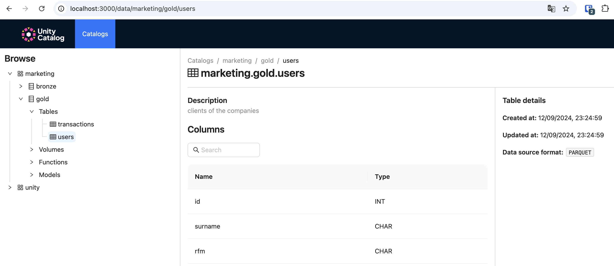

# Purpose

I try to do the same thing as 
- https://github.com/VillePuuska/Local-Lakehouse/tree/main
- https://github.com/zsvoboda/ngods-stocks


But with different tools

We setup a local lakehouse with
- a minio storage
- a unity catalog metastore
- 2 data sources from 2 postgresql database
- a mlflow server

We write python code to feed the lakehouse in 4 steps:

1) data contract : send metadata to the metastore (unity catalog)
2) ingest : load data from the sources (web app db and shop db in the postgreql instance) and write the the landing zone (bronze)
3) etl : load data from bronze, transform it (create `rfm` column) and write it to gold layer
4) train : load data from gold layer and train a RandomForest dummy model, tack the run in mlflow and write the model into mlflow-registy

# Setup

## Up infra

````bash
docker compose -f "docker-compose.yml" up -d --build
````

### Minio

On you computer write `~/.aws/credentials` file
````conf
[default]
endpoint_url = http://localhost:8999
s3 =
    endpoint_url = http://localhost:8999
aws_access_key_id=minioadmin
aws_secret_access_key=minioadmin
````

On minio `http://localhost:9001` you need to :
- login (user: minioadmin pass: minioadmin)
- create three buckets (you can execute `python setup_minio.py` to do it programmatically)
    - landing-bronze
    - lake-gold
    - mlflow-artifacts
    - (optional) unitycatalog-artifacts
- (optional) : create two users in Identity/Users and use the access-keys instead of the admin-access
    - etl : with a corresponding access-key / secret-key and use those in `~/.aws/credentials`
    - mlflow : with a corresponding access-key / secret-key and use those in mlflow container

## Application db

In this example, we have two data sources
- `web_app` the users from the web app with web app data like cookies
- `shop` the transactions from the local shop

The two data sources are related to the marketing analytics so we will load them and connect them in the lakehouse using a `user_id`.

## Unity catalog

This is an early adoption. So please git clone the official repo and execute the compose.yaml.
Or run it using the tarball.


## Python scripts
Setup python env with the tool of your choice

with pyenv+virtualenv and python3.10
````
pyenv virtualenv 3.10.15 venv
pip install -r python/requirements.txt
````
Run `data contract` to register your tables in Unity Catalog
````
python python/data_contract.py
````

Run ingestion to the lakehouse langing zone (bronze layer)
````
python python/ingest.py
````
Run ETL to clean data from bronze to gold. It cast the `amount` transactions column to float and create rfm segment column for the users.
````
python python/etl.py
````

See 
 - on unity catalog the metadata : `http://localhost:3000/data/marketing/bronze`
 - on minio the data : `http://localhost:9001/browser/landing-bronze`




Run training of the model and log it to mlflow
````
python python/train.py
````

See 
 - on mlflow experiment tracking the run : `http://localhost:5000/#/experiments/1`
 - (optional) on minio under the hood : `http://localhost:9001/browser/mlflow-artifacts/`


## Inference

Find the uri in the registry on minio or mlflow.

````console
(venv) ➜  modern_data_stack git:(main) ✗ mlflow models serve -m s3://mlflow-artifacts/1/aa2110d499664590be2aef98ee7d5ac1/artifacts/model -p 5001 --no-conda
2024/12/05 21:49:11 INFO mlflow.models.flavor_backend_registry: Selected backend for flavor 'python_function'
2024/12/05 21:49:11 INFO mlflow.pyfunc.backend: === Running command 'exec gunicorn --timeout=60 -b 127.0.0.1:5001 -w 1 ${GUNICORN_CMD_ARGS} -- mlflow.pyfunc.scoring_server.wsgi:app'
[2024-12-05 21:49:11 +0100] [13864] [INFO] Starting gunicorn 23.0.0
[2024-12-05 21:49:11 +0100] [13864] [INFO] Listening at: http://127.0.0.1:5001 (13864)
[2024-12-05 21:49:11 +0100] [13864] [INFO] Using worker: sync
[2024-12-05 21:49:11 +0100] [13870] [INFO] Booting worker with pid: 13870
````

Call the inference service from where you want

````console
(venv) ➜  modern_data_stack git:(main) ✗ curl http://127.0.0.1:5001/invocations -H 'Content-Type: application/json' -d '{"inputs":[{"CHAMPIONS":"0","NEW_FANS":"0","ROOKIES":"0","SLIPPING":"0","WHALES":"1"}]}'
{"predictions": [0]}%  
````

```console
(venv) ➜  modern_data_stack git:(main) ✗ curl http://127.0.0.1:5001/invocations -H 'Content-Type: application/json' -d '{"inputs":[{"CHAMPIONS":"0","NEW_FANS":"1","ROOKIES":"0","SLIPPING":"0","WHALES":"0"},{"CHAMPIONS":"1","NEW_FANS":"0","ROOKIES":"0","SLIPPING":"0","WHALES":"0"}]}'
{"predictions": [0, 0]}%  
```

TODO : Use UnityCatalog to follow this run id / model id ?
I think I will make a real FastAPI service for the inference and 
- use Unity Catalog in it to find the model
- log the inference in mlflow or log in in the lakehouse
